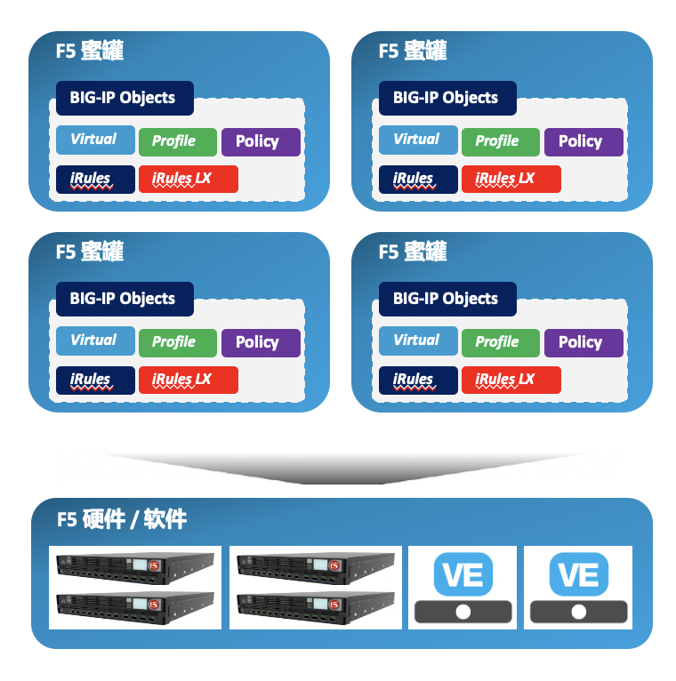

= 什么是 F5 蜜罐
:toc: manual

F5 蜜罐主要解决攻防博弈不对称现状，为企业和组织在安全攻防博弈中增加主动防御能力，F5 蜜罐实现原理及特点如下图：

* 可编程脚本实现，与 F5 硬件或软件灵活适配，可随时调整
* 架构简单，部署方便，F5 上的一个 VS 作为一个蜜罐，可让企业快速具备大量蜜罐
* 低交互，生产型，多种类型的蜜罐，例如TCP蜜罐、HTTP蜜罐、Web服务蜜罐等
* 结合 F5 AWAF等安全产品、组件，增加攻击者难度，可展现攻击方式和路径全貌
* 对接企业现有日志平台、入侵告警平台、或大数据平台，提升安全事件的响应速度

== 低交互蜜罐

F5 可编程蜜罐的优势在于低交互蜜罐：

* *大量蜜罐部署* - 结合可编程 iRule F5 上可快速部署大量前置蜜罐，一台低端 F5 设备可以部署 600 – 1000个蜜罐，一台 F5 VE 可部署 300 – 600 个蜜罐，而其它蜜罐厂商单个蜜罐设备支持100 – 200 个蜜罐
* *横向移动监测* - 结合大量部署的内网蜜罐，检测内网异常访问、横向移动，异常访问的动态告警
* *系统安全性高* - F5 蜜罐属于网络层蜜罐，防逃逸等机制简单，管理和数据隔开，基于访问控制；而商业蜜罐多为应用层蜜罐，防逃逸机制复杂，一旦蜜罐被攻破，风险较大
* *部署架构简单* - F5 蜜罐属于前置蜜罐，无需牵引引流，而蜜罐厂商蜜罐多分为后端蜜罐系统，和前置引流器
* *投资回报率高* - 可重复试用现有各区内已在线的 F5 设备；F5 VE 提供灵活的 License，配合VE 管理平台可按需部署或回收 VE 节点

== 高交互蜜罐

高交互蜜罐主要结合 F5 IRuleLX 和 F5 AWAF通过扩展可编程能力，以及安全属性的捕获来实现：

* iRulesLX 利用 Node.js 的编程能力增强 BIG-IP 在数据平面的可编程性，Node.js 是响应式异步编程最好的语言，有丰富的生态，广泛用于 IOT，边缘计算等领域，F5 设备自带 Node.js 运行环境，f5-nodejs 模块可编程精细化数据平面控制，F5 设备自带 Node.js 图形化设计环境，支持程序导入导出功能
* iRulesLX Node.js 结合 F5 AWAF 等安全产品、组件结合，增加攻击者难度，更易于展现出攻击者方式和路径的全貌，增加应用层防御检测，如特征库检测、撞库攻击防护、主动式 BOT 防护、基于流量行为防护，动态建模与更新，策略学习，自动化部署学习产生的防护策略

